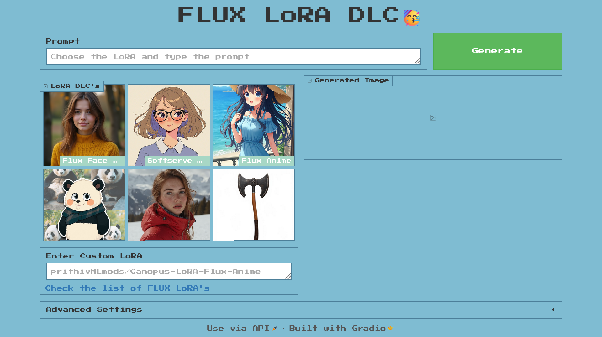
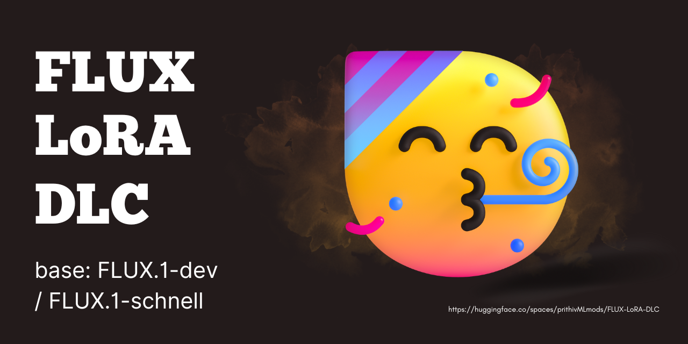

https://huggingface.co/spaces/prithivMLmods/FLUX-LoRA-DLC

# List of Flux Dev LoRA Repositories Used as of Now 

| No. | Repository Name | Link |
| --- | --------------- | ---- |
| 1   | Canopus-LoRA-Flux-FaceRealism | [Link](https://huggingface.co/prithivMLmods/Canopus-LoRA-Flux-FaceRealism) |
| 2   | softserve_anime | [Link](https://huggingface.co/alvdansen/softserve_anime) |
| 3   | Canopus-LoRA-Flux-Anime | [Link](https://huggingface.co/prithivMLmods/Canopus-LoRA-Flux-Anime) |
| 4   | FLUX.1-dev-LoRA-One-Click-Creative-Template | [Link](https://huggingface.co/Shakker-Labs/FLUX.1-dev-LoRA-One-Click-Creative-Template) |
| 5   | Canopus-LoRA-Flux-UltraRealism-2.0 | [Link](https://huggingface.co/prithivMLmods/Canopus-LoRA-Flux-UltraRealism-2.0) |
| 6   | Flux-Game-Assets-LoRA-v2 | [Link](https://huggingface.co/gokaygokay/Flux-Game-Assets-LoRA-v2) |
| 7   | softpasty-flux-dev | [Link](https://huggingface.co/alvdansen/softpasty-flux-dev) |
| 8   | FLUX.1-dev-LoRA-add-details | [Link](https://huggingface.co/Shakker-Labs/FLUX.1-dev-LoRA-add-details) |
| 9   | frosting_lane_flux | [Link](https://huggingface.co/alvdansen/frosting_lane_flux) |
| 10  | flux-ghibsky-illustration | [Link](https://huggingface.co/aleksa-codes/flux-ghibsky-illustration) |
| 11  | FLUX.1-dev-LoRA-Dark-Fantasy | [Link](https://huggingface.co/Shakker-Labs/FLUX.1-dev-LoRA-Dark-Fantasy) |
| 12  | Flux_1_Dev_LoRA_Paper-Cutout-Style | [Link](https://huggingface.co/Norod78/Flux_1_Dev_LoRA_Paper-Cutout-Style) |
| 13  | mooniverse | [Link](https://huggingface.co/alvdansen/mooniverse) |
| 14  | pola-photo-flux | [Link](https://huggingface.co/alvdansen/pola-photo-flux) |
| 15  | flux-tarot-v1 | [Link](https://huggingface.co/multimodalart/flux-tarot-v1) |
| 16  | Flux-Dev-Real-Anime-LoRA | [Link](https://huggingface.co/prithivMLmods/Flux-Dev-Real-Anime-LoRA) |
| 17  | Flux_Sticker_Lora | [Link](https://huggingface.co/diabolic6045/Flux_Sticker_Lora) |
| 18  | flux-RealismLora | [Link](https://huggingface.co/XLabs-AI/flux-RealismLora) |
| 19  | flux-koda | [Link](https://huggingface.co/alvdansen/flux-koda) |
| 20  | Cine-Aesthetic | [Link](https://huggingface.co/mgwr/Cine-Aesthetic) |
| 21  | flux_cute3D | [Link](https://huggingface.co/SebastianBodza/flux_cute3D) |
| 22  | flux_dreamscape | [Link](https://huggingface.co/bingbangboom/flux_dreamscape) |
| 23  | Canopus-Cute-Kawaii-Flux-LoRA | [Link](https://huggingface.co/prithivMLmods/Canopus-Cute-Kawaii-Flux-LoRA) |
| 24  | Flux-Pastel-Anime | [Link](https://huggingface.co/Raelina/Flux-Pastel-Anime) |
| 25  | FLUX.1-dev-LoRA-Vector-Journey | [Link](https://huggingface.co/Shakker-Labs/FLUX.1-dev-LoRA-Vector-Journey) |
| 26  | flux-miniature-worlds | [Link](https://huggingface.co/bingbangboom/flux-miniature-worlds) |
| 27  | bingbangboom_flux_surf | [Link](https://huggingface.co/glif-loradex-trainer/bingbangboom_flux_surf) |
| 28  | Canopus-Snoopy-Charlie-Brown-Flux-LoRA | [Link](https://huggingface.co/prithivMLmods/Canopus-Snoopy-Charlie-Brown-Flux-LoRA) |
| 29  | sonny-anime-fixed | [Link](https://huggingface.co/alvdansen/sonny-anime-fixed) |
| 30  | flux-multi-angle | [Link](https://huggingface.co/davisbro/flux-multi-angle) |

& More 

# Space Inspired From

| No. | Feature/Component | Description |
| --- | ----------------- | ----------- |
| 1   | **Title**          | Flux LoRA The Explorer |
| 2   | **Model**          | LoRA Fine-tuning with the Flux Model |
| 3   | **Exploration Mode** | Explore fine-tuned models within the Flux framework |
| 4   | **Interactivity**  | Allows users to experiment with different LoRA models |
| 5   | **UI**             | Clean interface inspired by multimodal designs |
| 6   | **Main Functionality** | Generate images using custom-trained LoRA models in Flux |
| 7   | **Usage Options**  | Various models for selection and generation within the app |
| 8   | **Integration**    | Hugging Face integration for easy access to pre-trained models |
| 9   | **Examples**       | Provides image samples for user inspiration |
| 10  | **Customization**  | User can modify prompts and parameters to explore model creativity |
| 11  | **Space URL**      | [flux-lora-the-explorer](https://huggingface.co/spaces/multimodalart/flux-lora-the-explorer) |

Check out the configuration reference at https://huggingface.co/docs/hub/spaces-config-reference
